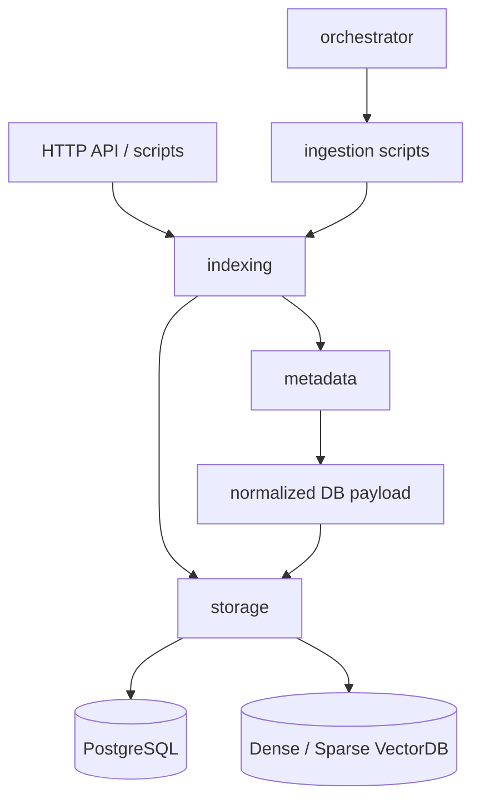

# Docset Hub 核心架构

`src/docset_hub` 是 Langtaosha 论文数据进入系统、形成检索资产并被搜索召回的核心领域模块。

本文档目录描述稳定的架构职责、跨模块契约和正式功能流。具体 API 参数、配置项和使用示例保留在各模块的详细手册中。

## 1. 系统目标

Docset Hub 负责解决两类核心问题：

1. 将多个来源的论文记录转换为统一元数据，写入 PostgreSQL，并建立 Dense、Sparse 和关键词检索资产。
2. 将用户查询路由到合适的检索分支，融合候选结果，并使用 PostgreSQL 元数据补全最终结果。

系统围绕以下主身份工作：

```text
source_name + source_record_id
  -> paper_source_id
  -> paper_id
  -> work_id
  -> Dense / Sparse retrieval document
```

详细契约见 [CORE_CONTRACTS.md](CORE_CONTRACTS.md)。

## 2. 模块职责

| 模块 | 核心职责 | 不负责 |
| --- | --- | --- |
| `metadata` | 将来源数据转换为统一、可验证的数据库写入 payload | 持久化、向量化、搜索 |
| `storage` | 封装 PostgreSQL、VectorDB 和底层检索能力 | 跨存储业务编排、HTTP API |
| `indexing` | 编排 metadata、storage、关键词处理、索引构建和检索融合 | 每日任务调度、HTTP 请求处理 |
| `orchestrator` | 调度每日抓取、入库、作者补全并生成运行 manifest | 数据转换规则、底层存储实现 |



## 3. 正式入口

| 场景 | 当前正式入口 | 说明 |
| --- | --- | --- |
| 单条论文入库 | `PaperIndexer.index_dict()` | 完成转换、metadata 写入、索引构建和关键词扩充 |
| 文件入库 | `scripts/backfill_source_records.py` | 批量调用 `PaperIndexer` |
| 每日数据任务 | `scripts/run_daily_orchestrator.py` | 创建并执行 `DailyPipeline` |
| 用户搜索 | `GET /api/scholar/search` | 当前正式 API，显式使用 `hybrid_retrieval` |
| 三路候选召回 | `PaperIndexer.hybrid_retrieval_search()` | Dense、Sparse、Keyword Lookup 并行召回与加权 RRF |

## 4. 两条核心功能流

- [数据写入与索引流](flows/DATA_INGESTION_FLOW.md)
- [查询与检索流](flows/SEARCH_RETRIEVAL_FLOW.md)

两条流通过 `work_id` 连接：

```text
写入流产生可检索文档
  -> VectorDB result.work_id
  -> MetadataDB.read_paper_by_work_id()
  -> 完整搜索结果
```

## 5. 当前重要边界

### 5.1 `PaperIndexer` 是应用编排层

尽管名称是 Indexer，`PaperIndexer` 当前同时负责编排：

- metadata 转换和写入；
- Dense、Sparse 和关键词索引构建；
- Dense、Sparse 和 Keyword Lookup 三路检索；
- RRF 融合、检索降级和 metadata hydrate。

因此架构 review 时应把它视为 Docset Hub 的应用服务层，而不是单纯的向量索引工具。

### 5.2 存在两种混合检索

| 入口 | 分支 | 所在层 |
| --- | --- | --- |
| `VectorDB.hybrid_search()` | Dense + Sparse | storage 层 |
| `PaperIndexer.hybrid_retrieval_search()` | Dense + Sparse + Keyword Lookup | indexing 编排层 |

正式搜索 API 当前使用后者。讨论“混合检索”时必须明确具体入口。

### 5.3 正式 API 与 `smart_search()` 尚未完全收束

正式 API 在 `app/main.py` 内执行 query understanding 和检索策略，并显式请求 `hybrid_retrieval`。`PaperIndexer.smart_search()` 也执行 query understanding，但主题搜索最终调用默认 `dense` 搜索。

在二者统一前，不能把 `smart_search()` 的行为直接视为正式 API 行为。

### 5.4 Orchestrator 是进程级编排器

`DailyPipeline` 当前通过 `subprocess` 调用抓取、回填和作者补全脚本。它的运行契约主要由命令返回码、日志和 manifest 构成，而不是稳定的 Python service 接口。

## 6. 模块文档

- [Indexing 架构](indexing/README.md)
- [Metadata 架构](metadata/README.md)
- [Orchestrator 架构](orchestrator/README.md)
- [Storage 架构](storage/README.md)
- [PaperIndexer 详细手册](indexing/PAPER_INDEXER_README.md)
- [MetadataTransformer 详细手册](metadata/TRANSFORMER_README.md)
- [MetadataDB 详细手册](storage/METADATA_DB_README.md)
- [VectorDB 详细手册](storage/VECTOR_DB_README.md)

## 7. Review 建议

Review 当前架构时，优先检查：

1. 每条正式功能流是否只有一个清晰入口。
2. `source_name`、`paper_id` 和 `work_id` 是否始终遵守核心契约。
3. PostgreSQL、Dense、Sparse 和关键词资产是否保持一致。
4. 可降级失败是否可观测，阻断性失败是否不会被标记为成功。
5. debug、legacy 和正式路径是否被明确区分。
