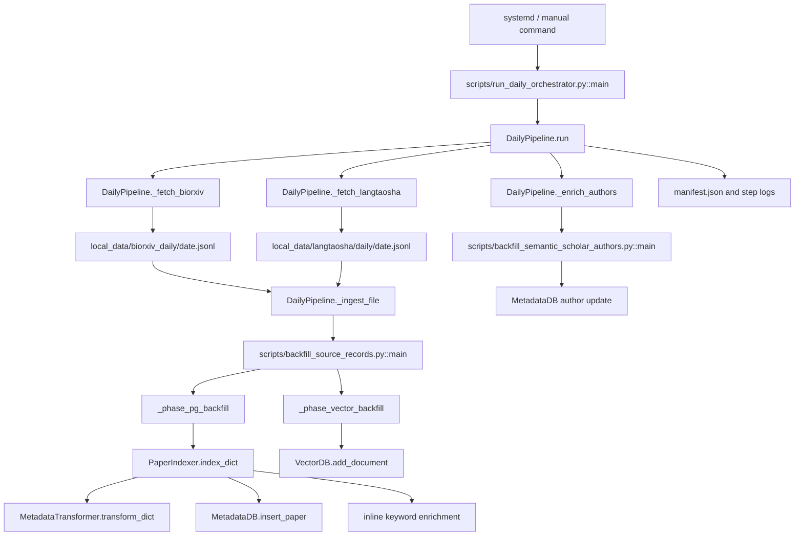

# 数据写入与索引流

本文档是 Langtaosha 每日数据流的架构地图和代码导航。它按照四个阶段描述当前真实执行路径：

```text
Fetching
  -> Backfilling / Ingestion
  -> Post-ingestion Enrichment
  -> Logging / Observability
```

Logging 贯穿前三个阶段，并在任务结束时生成汇总 manifest。

## 1. 一页总览

### 1.1 目标

将外部论文记录转化为：

- PostgreSQL 中可追溯、可去重的论文 metadata；
- 可通过 `work_id` 关联的 Dense 检索文档；
- 可用于关键词检索的 `paper_keywords`；
- 可选的作者补全数据；
- 能够复盘每次运行的 manifest 和日志。

### 1.2 当前正式调用链



### 1.3 四阶段边界

| 阶段 | 入口 | 核心职责 | 主要输出 |
| --- | --- | --- | --- |
| Fetching | `DailyPipeline._fetch_*()` | 从外部 source 获取论文并生成 Raw JSONL | source Raw JSONL |
| Backfilling / Ingestion | `backfill_source_records.py::main()` | 写入 PostgreSQL、生成关键词、回填 Dense 文档 | MetadataDB、Dense VectorDB、keywords |
| Post-ingestion Enrichment | `backfill_semantic_scholar_authors.py::main()` | 基于已入库论文补全作者信息 | 作者 metadata、enrichment 状态 |
| Logging / Observability | `DailyPipeline._run_command()` 与 `run()` | 保存命令、返回码、stdout、stderr 和汇总状态 | logs、manifest、docs log |

## 2. 启动入口与 Config 来源

### 2.1 自动运行入口

自动每日任务由 systemd service 启动：

```text
scripts/systemd/langtaosha-daily-ingest.service
  -> scripts/run_daily_orchestrator.py
  -> DailyPipeline
```

当前 service 显式传入：

```text
--config-path src/config/config_tecent_backend_server_use.yaml
```

因此当前自动任务写入：

```text
PostgreSQL: langtaosha_use
VectorDB:   langtaosha_use
```

### 2.2 手动运行入口

```bash
python scripts/run_daily_orchestrator.py \
  --date YYYY-MM-DD \
  --config-path src/config/config_tecent_backend_server_use.yaml
```

`run_daily_orchestrator.py::main()` 执行：

```text
parse_args()
  -> resolve target_date
  -> construct DailyPipelineConfig
  -> DailyPipeline(config).run()
```

若手动运行时未传 `--config-path`，CLI 默认使用：

```text
src/config/config_tecent_backend_server_test.yaml
```

### 2.3 Config 如何生效

`DailyPipeline` 自己不解析 YAML。它只保存 `config_path`，并将路径传给下游脚本：

```text
DailyPipelineConfig.config_path
  -> backfill_source_records.py --config-path
  -> backfill_semantic_scholar_authors.py --config-path
```

随后：

```text
backfill_source_records.py
  -> PaperIndexer(config_path)
  -> MetadataDB / VectorDB load config

backfill_semantic_scholar_authors.py
  -> MetadataDB(config_path)
```

Fetching 阶段目前不读取该 YAML。

另外，YAML 中的 `default_sources` 不决定 DailyPipeline 抓取哪些来源。当前 DailyPipeline 在 `run()` 中硬编码执行 bioRxiv 与 Langtaosha 两条抓取路径。

## 3. Stage 1: Fetching

### 3.1 阶段职责

Fetching 负责：

- 根据 `target_date` 调用 source-specific 抓取脚本；
- 将来源数据保存为 Raw JSONL；
- 保留必要的原始抓取证据；
- 确保即使当天无数据，也存在可识别的空 JSONL。

Fetching 不负责：

- 字段标准化；
- 论文身份解析；
- 数据库写入；
- Dense、Sparse 或关键词索引。

### 3.2 Orchestrator 入口

| Source | DailyPipeline 函数 | 抓取脚本 |
| --- | --- | --- |
| bioRxiv | `_fetch_biorxiv()` | `scripts/bioarxiv/biorxiv_api.py` |
| Langtaosha | `_fetch_langtaosha()` | `scripts/langtaosha/langtaosha_scrape.py` |

`DailyPipeline.run()` 随后调用 `_ensure_empty_file()`，保证预期 JSONL 路径存在，并统计非空记录数。

### 3.3 bioRxiv 数据路径

```text
DailyPipeline._fetch_biorxiv()
  -> scripts/bioarxiv/biorxiv_api.py historical
  -> biorxiv_fetch_raw.json
  -> payload["records"]
  -> DailyPipeline._write_jsonl()
  -> local_data/biorxiv_daily/<year>/<date>.jsonl
```

关键函数：

| 部件 | 函数 | 作用 |
| --- | --- | --- |
| Orchestrator | `DailyPipeline._fetch_biorxiv()` | 拼装命令并转换抓取结果 |
| bioRxiv client | `fetch_date_range()` | 分页请求 bioRxiv API |
| bioRxiv client | `command_historical()` | historical CLI 命令入口 |
| Orchestrator | `_write_jsonl()` | 写入每日 Raw JSONL |

### 3.4 Langtaosha 数据路径

```text
DailyPipeline._fetch_langtaosha()
  -> scripts/langtaosha/langtaosha_scrape.py --mode daily-update
  -> run_daily_update()
  -> local_data/langtaosha/daily/<year>/<date>.jsonl
```

与 bioRxiv 不同，Langtaosha 抓取脚本直接写入最终 Raw JSONL；DailyPipeline 不负责二次转换。

关键函数：

| 部件 | 函数 | 作用 |
| --- | --- | --- |
| Orchestrator | `DailyPipeline._fetch_langtaosha()` | 拼装并执行抓取命令 |
| Langtaosha scraper | `run_daily_update()` | 执行每日增量抓取 |
| Langtaosha scraper | `build_daily_path()` | 确定每日 JSONL 路径 |
| Langtaosha scraper | `write_jsonl()` | 写入来源记录 |

### 3.5 Fetching 输出边界

```text
Raw JSONL + explicit source_name
```

Raw JSONL 是 Fetching 与 Backfilling 之间的交付契约。它应当：

- 能逐行解析为 JSON object；
- 能追溯 source 与日期；
- 不要求已经符合数据库结构；
- 在无记录时允许为空文件。

## 4. Stage 2: Backfilling / Ingestion

### 4.1 阶段入口

DailyPipeline 对每个非空 Raw JSONL 调用：

```text
DailyPipeline._ingest_file()
  -> DailyPipeline._ingest_command()
  -> scripts/backfill_source_records.py
```

生成的命令形态：

```bash
python scripts/backfill_source_records.py \
  --config-path <config_path> \
  --records-root <raw_jsonl> \
  --source-name <source_name> \
  --stage <all|pg>
```

`run_vector_stage=True` 时传 `--stage all`；`--skip-vector` 时传 `--stage pg`。

### 4.2 Backfill 脚本的两个内部阶段

`backfill_source_records.py::main()` 创建两个 `PaperIndexer`：

```text
pg_indexer     = PaperIndexer(enable_vectorization=False)
vector_indexer = PaperIndexer(enable_vectorization=True)
```

随后根据 `--stage` 执行：

```text
Phase A: _phase_pg_backfill()
Phase B: _phase_vector_backfill()
```

| 内部阶段 | 输入 | 核心职责 | 当前输出 |
| --- | --- | --- | --- |
| Phase A: PG backfill | Raw JSONL | 转换、metadata 写入、关键词 enrichment、写入 Dense pending 状态 | PostgreSQL、keywords、embedding queue |
| Phase B: Vector backfill | MetadataDB pending/failed candidates | 从 PostgreSQL 重建索引文本并写入 Dense VectorDB | Dense 文档、embedding 状态 |

### 4.3 Phase A: PG backfill

调用链：

```text
backfill_source_records.py::_phase_pg_backfill()
  -> _iter_json_lines()
  -> PaperIndexer.index_dict(record, source_name)
  -> MetadataTransformer.transform_dict()
  -> MetadataDB.insert_paper()
  -> PaperIndexer._handle_keyword_enrichment()
  -> queue Dense embedding status pending
```

`PaperIndexer.index_dict()` 返回四个子结果：

```text
metadata
vectorization
sparse_vectorization
keyword_enrichment
```

但 Phase A 使用的 `pg_indexer` 禁用了 VectorDB，因此：

- metadata 写入实际执行；
- keyword enrichment 实际执行；
- Dense inline vectorization 跳过；
- Sparse inline vectorization 跳过；
- 脚本根据 metadata 写入结果显式创建 Dense pending queue。

### 4.4 Metadata 核心调用链

```text
MetadataTransformer.transform_dict()
  -> MetadataRouter
  -> SourceAdapter
  -> NormalizedRecord
  -> MetadataNormalizer
  -> MetadataDBMapper
  -> db_payload + upsert_key

MetadataDB.insert_paper()
  -> _resolve_and_apply()
  -> _resolve_match_by_identity()
  -> insert / append source / update / skip
  -> _apply_canonical_strategy()
  -> structured write result
```

身份解析结果：

```text
same_source | cross_source | no_match
```

关键输出：

```text
paper_id
work_id
status_code
canonical_changed
canonical_source_id
canonical_source_name
```

### 4.5 Inline Keyword Enrichment

关键词 enrichment 当前属于 Phase A 写入路径的一部分：

```text
PaperIndexer._handle_keyword_enrichment()
  -> KeywordEnrichmentService.extract_keywords()
  -> MetadataDB.upsert_generated_keywords()
```

它不是 `DailyPipeline._enrich_authors()` 所代表的后置 enrichment。

### 4.6 Phase B: Dense Vector backfill

调用链：

```text
backfill_source_records.py::_phase_vector_backfill()
  -> MetadataDB.list_embedding_candidates(status=pending|failed)
  -> MetadataDB.read_paper()
  -> _build_text_from_paper_info()
  -> VectorDB.add_document()
  -> MetadataDB.mark_embedding_succeeded() / mark_embedding_failed()
```

Dense 索引文本优先级：

```text
canonical title + canonical abstract
  -> canonical title
  -> current source title + abstract
  -> current source title
  -> fail / skip
```

### 4.7 当前 Sparse 边界

当前每日 `backfill_source_records.py --stage all` 的 Phase B 只调用：

```text
VectorDB.add_document()
```

它没有调用：

```text
VectorDB.add_sparse_document()
```

因此，当前 DailyPipeline 正式路径不能被描述为自动完成 Sparse backfill。Sparse 需要其他脚本或单独路径完成，并应通过一致性检查确认覆盖率。

### 4.8 Backfilling 核心定位表

| 想定位的问题 | 首先查看 |
| --- | --- |
| Raw JSONL 如何遍历 | `_iter_jsonl_files()`、`_iter_json_lines()` |
| PG backfill 主循环 | `_phase_pg_backfill()` |
| 单条论文完整写入 | `PaperIndexer.index_dict()` |
| 来源字段如何统一 | `MetadataTransformer.transform_dict()` |
| 论文如何去重和选择 canonical | `MetadataDB._resolve_and_apply()` |
| 何时加入 Dense pending queue | `_should_queue_for_backfill()` |
| Dense pending 如何回填 | `_phase_vector_backfill()` |
| 索引文本如何构造 | `_build_text_from_paper_info()` |
| 关键词何时生成 | `PaperIndexer._handle_keyword_enrichment()` |

## 5. Stage 3: Post-ingestion Enrichment

### 5.1 阶段职责

Post-ingestion Enrichment 基于已经写入 MetadataDB 的论文补充外部特征。当前 DailyPipeline 只编排 Semantic Scholar 作者补全。

它与 Inline Keyword Enrichment 的区别：

| 类型 | 触发位置 | 是否依赖已入库论文 | 当前是否独立子进程 |
| --- | --- | --- | --- |
| Keyword enrichment | `PaperIndexer.index_dict()` 内部 | 是，依赖 `paper_id` | 否 |
| Author enrichment | Metadata 与 Dense backfill 之后 | 是 | 是 |

### 5.2 作者补全调用链

```text
DailyPipeline._enrich_authors(source_name)
  -> scripts/backfill_semantic_scholar_authors.py::main()
  -> MetadataDB.iter_papers_for_author_enrichment()
  -> SemanticScholarClient
  -> process_papers_with_batch_api() or process_papers()
  -> MetadataDB.update_author_enrichment()
  -> MetadataDB.record_author_enrichment_status()
```

关键函数：

| 函数 | 作用 |
| --- | --- |
| `DailyPipeline._enrich_authors()` | 构造作者补全命令和输出路径 |
| `MetadataDB.iter_papers_for_author_enrichment()` | 选择目标 source/date 的待补全论文 |
| `process_papers_with_batch_api()` | 批量调用 Semantic Scholar |
| `process_papers()` | 逐条调用 Semantic Scholar |
| `MetadataDB.update_author_enrichment()` | 更新作者信息 |
| `MetadataDB.record_author_enrichment_status()` | 保存单条处理状态 |

作者补全当前被标记为 non-blocking。其失败不会阻断已完成的 metadata 与 Dense backfill。

## 6. Stage 4: Logging / Observability

### 6.1 阶段职责

Logging 负责保留每次运行的执行证据：

- 实际执行的命令和 config path；
- 每个步骤的返回码和状态；
- stdout 与 stderr；
- 抓取记录数；
- 作者补全结果；
- 整体任务 manifest。

### 6.2 运行目录

每次运行按目标日期写入：

```text
local_data/daily_orchestrator/<target_date>/
```

主要文件：

| 文件 | 产生者 | 作用 |
| --- | --- | --- |
| `manifest.json` | `DailyPipeline.run()` | 汇总步骤、命令、状态和返回码 |
| `biorxiv_fetch_raw.json` | bioRxiv 抓取命令 | 保存 bioRxiv 原始 API 结果 |
| `logs/<step>.stdout.log` | `DailyPipeline._run_command()` | 子进程标准输出 |
| `logs/<step>.stderr.log` | `DailyPipeline._run_command()` | 子进程错误输出 |
| `semantic_scholar_<source>.json` | 作者补全脚本 | 作者补全汇总 |
| `semantic_scholar_<source>.jsonl` | 作者补全脚本 | 作者补全逐条结果 |

此外，DailyPipeline 将摘要事件追加到：

```text
docs/daily_orchestrator_log/
```

### 6.3 Logging 核心调用链

```text
DailyPipeline._run_command()
  -> subprocess.run(capture_output=True)
  -> write stdout log
  -> write stderr log
  -> return step result

DailyPipeline.run() finally
  -> _write_json(manifest.json)
  -> _append_docs_log()
```

### 6.4 当前状态风险

当前步骤状态使用：

```text
ok | failed | skipped | dry_run
```

作者补全使用 `allow_failure=True`。当其返回码非零时，步骤可能被标记为 `skipped`；而整体任务把 `skipped` 视为可接受状态。

因此 review 运行结果时不能只检查：

```text
manifest.status == "ok"
```

还需要检查：

```text
step.status
step.returncode
step.reason
stderr log
subtask manifest
```

## 7. 数据与身份如何贯穿四阶段

```text
target_date
  -> source Raw JSONL
  -> explicit source_name
  -> db_payload + upsert_key
  -> paper_id + work_id + canonical source
  -> Dense document(work_id)
  -> keyword rows(paper_id)
  -> author enrichment(paper_id)
  -> run manifest(target_date)
```

关键身份：

| 字段 | 作用 |
| --- | --- |
| `source_name` | 连接抓取来源、Metadata source 和 VectorDB collection |
| `source_record_id` | 保证同来源记录幂等 |
| `paper_id` | PostgreSQL 内部论文身份，关键词和作者补全使用 |
| `work_id` | PostgreSQL 与 VectorDB 文档之间的关联身份 |
| `canonical_source_id` | 决定当前 canonical metadata 与 Dense 索引文本 |

详细语义见 [核心契约](../CORE_CONTRACTS.md)。

## 8. 按问题定位代码

| 问题 | 入口文件 | 核心函数 |
| --- | --- | --- |
| 每日任务为何使用某个 config | `scripts/run_daily_orchestrator.py`、systemd service | `parse_args()`、`main()` |
| 四阶段按什么顺序执行 | `daily_pipeline.py` | `DailyPipeline.run()` |
| 某个抓取命令如何生成 | `daily_pipeline.py` | `_fetch_biorxiv()`、`_fetch_langtaosha()` |
| Raw JSONL 写到哪里 | `daily_pipeline.py`、source scraper | `_biorxiv_daily_path()`、`_langtaosha_daily_path()` |
| 空 JSONL 为什么仍然存在 | `daily_pipeline.py` | `_ensure_empty_file()` |
| 入库脚本如何选择 PG 或 Vector 阶段 | `backfill_source_records.py` | `parse_args()`、`main()` |
| 单条记录如何进入 MetadataDB | `paper_indexer.py` | `PaperIndexer.index_dict()` |
| 来源 payload 如何转换 | `metadata/transformer.py` | `MetadataTransformer.transform_dict()` |
| 论文身份如何匹配 | `storage/metadata_db.py` | `_resolve_match_by_identity()` |
| canonical source 如何选择 | `storage/metadata_db.py` | `_apply_canonical_strategy()` |
| Dense backfill 从哪里找候选 | `backfill_source_records.py` | `_snapshot_candidates()` |
| Dense 文档如何写入 | `backfill_source_records.py`、`vector_db.py` | `_phase_vector_backfill()`、`VectorDB.add_document()` |
| Sparse 为什么没有随每日任务完成 | `backfill_source_records.py` | `_phase_vector_backfill()` 当前未调用 `add_sparse_document()` |
| 关键词何时生成 | `paper_indexer.py` | `_handle_keyword_enrichment()` |
| 作者如何补全 | `backfill_semantic_scholar_authors.py` | `main()`、`process_papers_with_batch_api()` |
| 每步日志在哪里生成 | `daily_pipeline.py` | `_run_command()` |
| manifest 如何汇总 | `daily_pipeline.py` | `run()` 的 `finally` block |

## 9. 当前事实与目标架构差距

| 主题 | 当前事实 | 需要继续明确 |
| --- | --- | --- |
| Source 编排 | bioRxiv 与 Langtaosha 硬编码在 `DailyPipeline.run()` | 是否改为 source registry / config 驱动 |
| Config | DailyPipeline 只透传路径 | 是否在 manifest 顶层记录解析后的目标环境 |
| Metadata 写入 | Phase A 使用 `PaperIndexer.index_dict()` | 顶层 success 与子阶段降级语义 |
| Dense | Phase B 有 pending/failed queue 与状态 | 覆盖率、一致性和失败补偿 |
| Sparse | 不在当前每日 backfill Phase B 中 | 正式入口、状态和一致性策略 |
| Keyword enrichment | 内联在 PG backfill | 是否应独立重试和观测 |
| Author enrichment | 独立、non-blocking | 非零返回码不应伪装成普通 skip |
| Logging | 有 step logs 与 manifest | 缺少统一指标和 end-to-end 可检索验证 |

## 10. Review 检查点

1. Fetching 是否成功生成可解析且可追溯的 Raw JSONL。
2. Raw JSONL 与显式 `source_name` 是否一致。
3. Phase A 是否正确完成 identity resolution、canonical 选择和 metadata 写入。
4. Keyword enrichment 失败是否能从单条写入结果中识别。
5. 应进入 Dense queue 的记录是否全部进入 `pending`。
6. Phase B 是否正确处理 `pending` 与 `failed` 候选。
7. PostgreSQL 与 Dense VectorDB 是否可通过 `work_id` 一致关联。
8. Sparse 未覆盖是否被单独统计，而不是被误认为已完成。
9. 作者补全失败是否可见且可重试。
10. `manifest.status` 是否与各步骤返回码和实际可检索性一致。

## 11. 相关文档

- [Docset Hub 总览](../README.md)
- [核心契约](../CORE_CONTRACTS.md)
- [Orchestrator 架构](../orchestrator/ORCHESTRATOR_README.md)
- [Metadata 架构](../metadata/README.md)
- [Indexing 架构](../indexing/README.md)
- [Storage 架构](../storage/README.md)
- [查询与检索流](SEARCH_RETRIEVAL_FLOW.md)
- [2026-06-05 数据流交付地图](../../../../implementation_log/20260605/01_data_flow_delivery_map.md)
