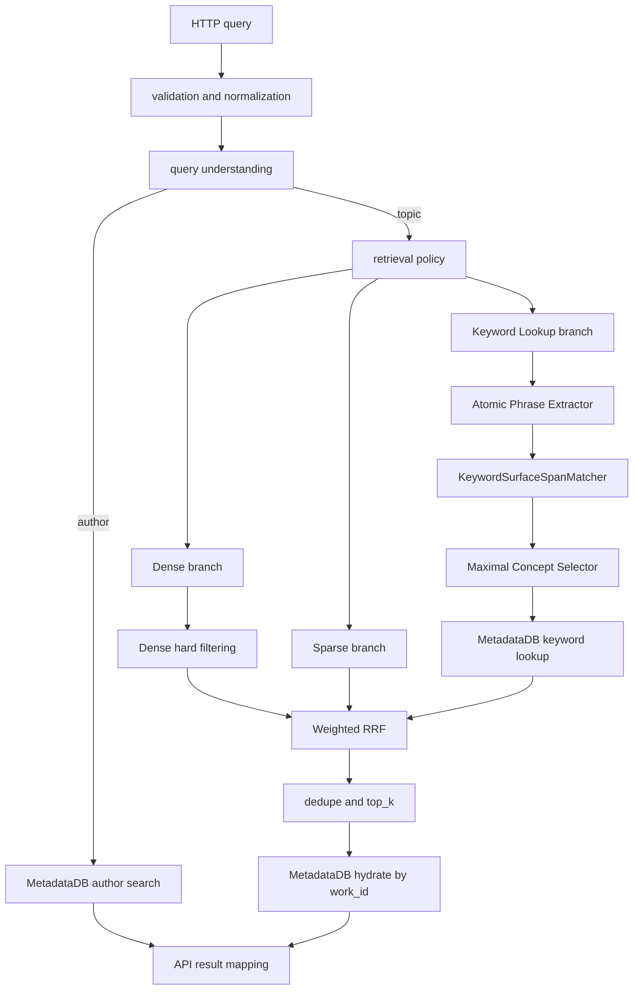

# 查询与检索流

本文档描述用户 query 如何通过正式 API 形成最终论文结果。它描述稳定架构，不记录某次交付状态。

## 1. 正式入口

当前正式用户搜索入口：

```http
GET /api/scholar/search
```

当前主调用链：

```text
app/main.py::api_scholar_search
  -> run_scholar_search
  -> QueryUnderstandingService.analyze
  -> author route or prioritized vector search
  -> PaperIndexer.search(search_type="hybrid_retrieval")
  -> PaperIndexer.hybrid_retrieval_search
  -> result mapping
  -> API response
```

## 2. 总体流程



## 3. Query Understanding

`QueryUnderstandingService` 负责：

- query normalization；
- 作者匹配与作者候选；
- query correction；
- 路由选择。

主要路由：

| Route | 后续行为 |
| --- | --- |
| `metadata_author` | 使用 MetadataDB 作者检索 |
| `author_suggestion` | 返回作者候选，不执行论文检索 |
| semantic/vector route | 进入主题检索 |
| `none` | 返回稳定的空或错误语义 |

正式 API 还包含自己的检索策略和结果映射，因此 `PaperIndexer.smart_search()` 当前不是正式 API 的等价入口。

## 4. 三路候选召回

`PaperIndexer.hybrid_retrieval_search()` 并行执行：

| 分支 | 实现来源 | 主要作用 |
| --- | --- | --- |
| Dense | `VectorDB.dense_search()` | 语义泛化召回 |
| Sparse | `VectorDB.sparse_search()` | BM25 词面召回 |
| Keyword Lookup | Span Matcher + MetadataDB keyword lookup | 从 query span 识别有关键词证据的概念，并执行关键词召回 |

Dense 候选在进入融合前经过硬规则过滤。Sparse 与 Keyword Lookup 候选需要携带正向分支证据。

单个分支失败时，其余分支继续执行；所有请求分支均失败时，检索整体失败。

### 4.1 Span Matcher 在正式检索中的位置

Span Matcher 是当前正式主题检索的重要组成部分，但只在三路召回中的 **Keyword Lookup 分支**执行，不属于 `QueryUnderstandingService.analyze()` 的路由判断过程，也不参与 Dense 或 Sparse 分支。

当前正式执行链：

```text
PaperIndexer.hybrid_retrieval_search
  -> _run_keyword_lookup_retrieval_branch
  -> QueryPhraseNormalizer
  -> AtomicPhraseExtractor
  -> MetadataDBPhraseLexicon
  -> KeywordSurfaceSpanMatcher
  -> SpanMatcherExecutor
  -> MaximalConceptSelector
  -> match_paper_keywords_with_lookup_plan
  -> MetadataDB keyword lookup
```

当前正式搜索只使用：

```text
KeywordSurfaceSpanMatcher
```

它根据 MetadataDB 中的 keyword lexicon 对 query span 做 surface matching，并将有正向证据的 selected concepts 交给 Keyword Lookup。当前正式检索链**不使用** `RemoteOntologySpanMatcher` 或 `CompositeSpanMatcher`；远程 UMLS / MeSH ontology matching 主要保留在 Span Matcher 调试接口、示例和测试流程中。

以下情况不会执行 Span Matcher：

- query understanding 路由到 `metadata_author` 或 `author_suggestion`；
- 直接调用 `PaperIndexer.search()` 并使用默认 `search_type="dense"`；
- 调用 `hybrid_retrieval_search(include_keyword_lookup=False)`。

Keyword Lookup 分支默认开启。若该分支中的 Span Matcher 或 MetadataDB keyword lookup 失败，当前混合检索会记录分支失败并继续使用 Dense 与 Sparse；只有所有请求分支均失败时，检索整体失败。

## 5. 候选融合

当前三路检索使用加权 Reciprocal Rank Fusion：

```text
rrf_score += branch_weight / (rrf_k + branch_rank)
```

默认权重：

```text
dense: 0.4
sparse: 0.4
keyword_lookup: 0.2
```

融合结果通过 `work_id` 去重，并在 `retrieval_debug` 中保留：

- `matched_retrievers`
- 各分支 rank
- 各分支原始 score
- 分支失败信息

融合后的 `similarity` 实际承载 RRF score，不能解释为普通 Dense 相似度。

## 6. Metadata Hydration

融合结果是轻量检索结果。`PaperIndexer` 使用：

```text
SearchResult.work_id
  -> MetadataDB.read_paper_by_work_id()
  -> complete metadata
```

若 VectorDB 返回的 `work_id` 在 MetadataDB 中不存在，该结果当前不会被加入 hydrated results，并记录警告。这属于跨存储一致性异常。

## 7. 两种 Hybrid 的区别

| 入口 | 分支 | 正式 API 是否使用 |
| --- | --- | --- |
| `VectorDB.hybrid_search()` | Dense + Sparse | 当前否 |
| `PaperIndexer.hybrid_retrieval_search()` | Dense + Sparse + Keyword Lookup | 当前是 |

`VectorDB.hybrid_search()` 是 storage 层能力；`PaperIndexer.hybrid_retrieval_search()` 是应用层候选池构建与降级策略。

## 8. 当前架构风险

### 8.1 正式入口分叉

仓库中存在正式 API、`PaperIndexer.smart_search()`、直接 `PaperIndexer.search()`、调试页面和回放脚本。它们可能使用不同搜索类型和 query understanding 行为。

### 8.2 Score 语义混用

Dense similarity、Sparse/BM25 score、Keyword score 和 RRF score 不可直接比较。对外字段名和内部 trace 应明确区分。

### 8.3 Source 合并与全局排序

正式 API 可能在每个 source 检索后进行额外优先级合并。Review 时需要确认该策略是否符合产品预期，以及是否扭曲全局相关性排序。

### 8.4 Search Trace 不完整

理想 trace 应能通过 `request_id` 还原 query understanding、各分支输入输出、过滤、融合、hydrate 和最终映射。

## 9. Review 检查点

1. 正式 API、回放和评估是否调用同一检索策略。
2. query understanding 的路由和纠错是否可解释。
3. 每个分支的失败、空结果与正向证据是否可区分。
4. RRF 权重、阈值和候选池大小是否可追溯。
5. 多概念 query 是否避免只命中泛化单概念。
6. hydrate 缺失是否被统计为一致性异常。
7. API 返回的 score 和 reasons 是否与内部检索证据一致。

## 10. 相关文档

- [核心契约](../CORE_CONTRACTS.md)
- [Indexing 架构](../indexing/README.md)
- [Storage 架构](../storage/README.md)
- [2026-06-05 搜索功能流交付地图](../../../../implementation_log/20260605/02_search_flow_delivery_map.md)
