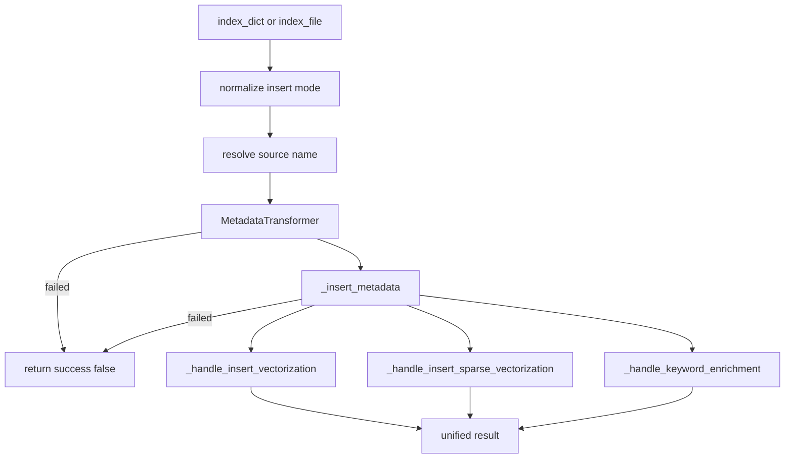
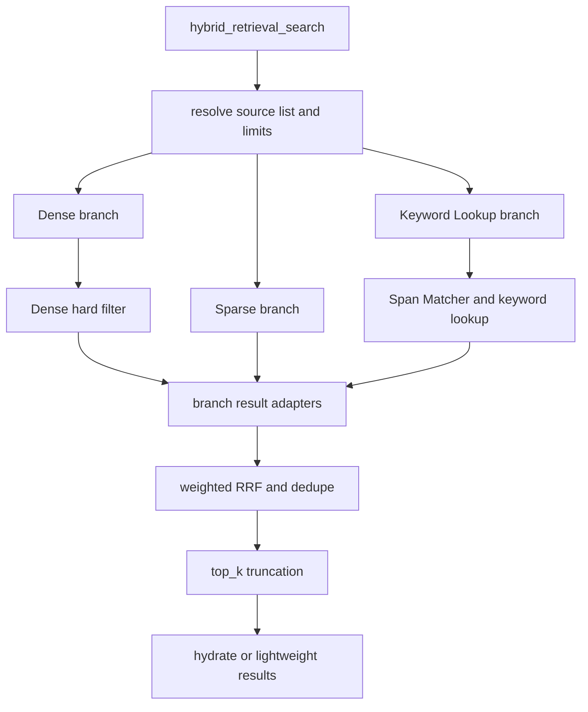

# PaperIndexer 功能地图

本文档按照功能职责梳理 `src/docset_hub/indexing/paper_indexer.py`。它描述当前真实实现中的函数分组、调用关系、决策边界和结果语义，不按源码出现顺序逐个复述实现。

## 1. 定位与边界

`PaperIndexer` 是 MetadataDB、VectorDB、MetadataTransformer、Keyword Enrichment 和 Query Understanding 之间的应用编排层。

它负责：

- 将 raw paper 转换并写入 MetadataDB；
- 根据 metadata 写入结果决定是否刷新 Dense、Sparse 和 keyword 资产；
- 提供 Dense、Sparse、storage hybrid 和应用层三路 hybrid 检索入口；
- 对三路召回结果执行过滤、适配、RRF、截断和 hydrate；
- 提供论文读取与删除入口。

它不负责：

- HTTP 参数校验和 API 结果映射；
- source 原始数据抓取；
- MetadataDB 内部论文身份解析与 canonical 选择；
- VectorDB 的底层写入和搜索协议；
- 正式 API 的跨 source 优先级合并。

## 2. 功能分组总览

| 功能组 | Public 入口 | 主要内部函数 | 主要输出 |
| --- | --- | --- | --- |
| 初始化与依赖装配 | `__init__()` | 无 | transformer、metadata DB、可选 vector DB、keyword enrichment、query understanding |
| 写入与索引资产刷新 | `index_dict()`、`index_file()` | `_insert_metadata()`、`_handle_insert_vectorization()`、`_handle_insert_sparse_vectorization()`、`_handle_keyword_enrichment()` | metadata、Dense、Sparse、keywords 的分阶段结果 |
| 通用检索路由 | `search()` | `_resolve_source_list()`、`_hydrate_search_results()`、`_search_results_to_lightweight_dicts()` | hydrated 或轻量检索结果 |
| 三路混合检索 | `hybrid_retrieval_search()` | 三个 branch runner、branch adapter、`_weighted_rrf_merge_retrieval_branches()` | RRF 排序并截断后的结果 |
| Query Understanding 检索 | `smart_search()` | `_merge_search_result_batches()` | route、search query、理解结果和论文结果 |
| 读取与删除 | `read()`、`delete()` | `_resolve_source_name()` | metadata 读取结果或跨存储删除结果 |
| 公共规则与适配 | 无 | source resolver、index text builder、safe conversion、hydrate | 被写入和检索流程复用的稳定规则 |

## 3. 初始化与依赖装配

### 3.1 `__init__()`

```text
PaperIndexer(config_path, enable_vectorization, enable_keyword_enrichment)
  -> init_config(config_path)
  -> get_default_sources()
  -> MetadataTransformer()
  -> MetadataDB(config_path)
  -> VectorDB(config_path)                    [enable_vectorization=True]
  -> KeywordEnrichmentService(config_path)   [enable_keyword_enrichment=True]
  -> QueryUnderstandingService(metadata_db)
```

关键语义：

- `config_path` 不存在时直接失败；
- `enable_vectorization=False` 会同时关闭 Dense/Sparse 写入和所有向量检索；
- `enable_keyword_enrichment=False` 只关闭论文入库后的关键词扩充，不会关闭检索时的 Keyword Lookup；
- `default_sources` 同时用于单 source 写入校验和多 source 搜索范围校验。

## 4. 写入与索引资产刷新

### 4.1 Public 写入入口

`index_dict()` 与 `index_file()` 只有输入转换方式不同，后续编排相同：



主流程阻断规则：

- transform 失败：不写 metadata，也不刷新检索资产；
- metadata 写入失败：不刷新 Dense、Sparse 和 keywords；
- metadata 写入成功后，Dense、Sparse 或 keyword enrichment 单独失败不会将顶层 `success` 改为 `False`，调用方必须检查各阶段结果。

### 4.2 Metadata 写入适配

| 函数 | 职责 |
| --- | --- |
| `_normalize_insert_mode()` | 将所有非 `insert` mode 降级为 `insert` |
| `_resolve_source_name()` | 校验单个 source；多默认 source 时要求调用方显式指定 |
| `_insert_metadata()` | 调用 `MetadataDB.insert_paper()`，并将写入结果适配为后续索引决策需要的字段 |

`_insert_metadata()` 提供的关键决策字段：

```text
status_code
paper_id
work_id
canonical_changed
canonical_source_id
canonical_source_name
```

### 4.3 Dense 与 Sparse 刷新决策

Dense 与 Sparse 共享 `_get_insert_vectorization_decision()`：

| Metadata 状态 | 刷新条件 |
| --- | --- |
| `INSERT_NEW_PAPER` | 始终刷新 |
| `INSERT_APPEND_SOURCE` | 仅 `canonical_changed=True` 时刷新 |
| `INSERT_UPDATE_SAME_SOURCE` | 当前写入 source 是 canonical source 时刷新 |
| 其他状态 | 跳过 |

相关函数：

| 函数 | 职责 |
| --- | --- |
| `_handle_insert_vectorization()` | 判断是否写 Dense；维护 embedding pending、succeeded、failed 状态 |
| `_handle_insert_sparse_vectorization()` | 判断是否写 BM25 Sparse；要求 sparse 配置开启 |
| `_is_sparse_vectorization_enabled()` | 解析 VectorDB sparse 配置开关 |
| `_build_index_text()` | 为 Dense 和 Sparse 构造同一份 canonical-first 索引文本 |
| `_vectorize_document()` | 调用 `VectorDB.add_document()` |
| `_sparse_vectorize_document()` | 调用 `VectorDB.add_sparse_document()` |

索引文本规则：

```text
canonical title + canonical abstract
  -> canonical title
  -> current source title + abstract
  -> current source title
  -> skip
```

### 4.4 Keyword Enrichment

`_handle_keyword_enrichment()` 在 metadata 写入后执行论文关键词抽取与写回。它与检索阶段的 Keyword Lookup、Span Matcher 是不同职责：

```text
Keyword Enrichment: paper text -> generated paper_keywords
Keyword Lookup:      query spans -> matched concepts -> candidate papers
```

Keyword Enrichment 使用独立触发规则，并通过 `MetadataDB.upsert_generated_keywords()` 写入结果。失败时顶层写入仍可能成功。

## 5. 检索功能

### 5.1 `search()`：统一底层检索入口

```text
search(query, source_list, top_k, hydrate, search_type)
  -> resolve source list
  -> search_type == hybrid_retrieval
       -> hybrid_retrieval_search()
     otherwise
       -> VectorDB.search(search_type)
  -> hydrate or lightweight serialization
```

支持的 `search_type`：

| 类型 | 实际执行 |
| --- | --- |
| `dense` | `VectorDB.search(search_type="dense")` |
| `sparse` | `VectorDB.search(search_type="sparse")` |
| `hybrid` | storage 层 Dense + Sparse hybrid |
| `hybrid_retrieval` | `PaperIndexer` 应用层 Dense + Sparse + Keyword Lookup |

注意：`search()` 默认 `search_type="dense"`；正式 Scholar API 显式使用 `hybrid_retrieval`。

### 5.2 `hybrid_retrieval_search()`：三路候选池构建



#### 候选池与截断

每个分支请求的候选数量：

```text
candidate_k = max(top_k * candidate_multiplier, min_candidate_k)
```

默认值：

```text
candidate_multiplier = 5
min_candidate_k = 50
rrf_k = 60
```

RRF 对所有分支候选按 `work_id` 优先去重，完成评分与排序后执行：

```text
fused_results[:top_k]
```

因此存在两层截断：

1. RRF 前，各分支最多返回 `candidate_k`；
2. RRF 后，融合结果强制截断为 `top_k`。

正式 API 会按 source group 分别调用该流程；跨 group 合并由 `app/main.py` 负责，不属于 `PaperIndexer`。

### 5.3 三个召回分支

| 函数 | 职责 | 进入 RRF 前的约束 |
| --- | --- | --- |
| `_run_dense_retrieval_branch()` | Dense search + DB-backed hard filter | 通过 Dense 硬规则 |
| `_run_sparse_retrieval_branch()` | BM25 Sparse search | 原始 score 必须为正 |
| `_run_keyword_lookup_retrieval_branch()` | Span Matcher + MetadataDB keyword lookup | 必须存在 selected concepts 和正向 lookup score |

Keyword Lookup 当前执行：

```text
QueryPhraseNormalizer
  -> AtomicPhraseExtractor
  -> MetadataDBPhraseLexicon
  -> KeywordSurfaceSpanMatcher
  -> SpanMatcherExecutor
  -> MaximalConceptSelector
  -> match_paper_keywords_with_lookup_plan
```

### 5.4 Branch 结果适配与 RRF

| 函数 | 职责 |
| --- | --- |
| `_search_result_to_filter_payload()` | 将 Dense `SearchResult` 转为硬过滤输入 |
| `_adapt_dense_payloads_to_branch_results()` | 将过滤后的 Dense 结果转换为统一 branch 结构 |
| `_adapt_search_results_to_branch_results()` | 将 Sparse 等 `SearchResult` 转为统一 branch 结构 |
| `_adapt_keyword_lookup_results_to_branch_results()` | 将 keyword lookup 结果转为统一 branch 结构 |
| `_resolve_hybrid_retrieval_weights()` | 解析非负分支权重并处理无效配置 |
| `_weighted_rrf_merge_retrieval_branches()` | 按 dedupe key 聚合、计算 weighted RRF、排序并执行 `top_k` 截断 |
| `_retrieval_dedupe_key()` | 优先使用 `work_id`，其次 `paper_id`，最后使用 branch rank |
| `_safe_float()` | 将分支 score 安全转换为 float |

默认 RRF 权重：

```text
dense: 0.4
sparse: 0.4
keyword_lookup: 0.2
```

单个分支失败时记录到 `retrieval_debug.branch_failures` 并继续；所有请求分支失败时整体失败。

### 5.5 结果输出与 Hydration

| 函数 | 职责 |
| --- | --- |
| `_hydrate_search_results()` | 使用 `work_id` 从 MetadataDB 补全论文 metadata |
| `_search_results_to_lightweight_dicts()` | 不查询 metadata，仅序列化轻量结果 |

Hydration 发生在 RRF 截断之后。若某个已进入 top-k 的 `work_id` 在 MetadataDB 中不存在，该结果会被丢弃并记录警告；当前不会从截断外候选中补位。

## 6. Query Understanding 检索

### 6.1 `smart_search()`

```text
smart_search(query)
  -> QueryUnderstandingService.analyze()
  -> metadata_author: MetadataDB.search_by_author()
  -> author_suggestion: return suggestions without paper search
  -> vector route:
       corrected or normalized query
       + optional expanded queries
       -> search()
       -> _merge_search_result_batches()
```

当前注意事项：

- `smart_search()` 的主题检索调用 `search()` 时未显式传入 `search_type`，因此默认走 Dense；
- 它不是正式 `/api/scholar/search` 的等价入口；
- `_merge_search_result_batches()` 按结果 score 合并 query expansion 批次并截断为 `top_k`。

## 7. 读取与删除

### 7.1 `read()`

- 提供 `work_id` 时调用 `MetadataDB.read_paper_by_work_id()`；
- 否则使用 `paper_id` 调用 `MetadataDB.read_paper()`；
- 两者都未提供时抛出 `ValueError`。

### 7.2 `delete()`

```text
delete(work_id, source_name, text_type)
  -> resolve source name
  -> MetadataDB.delete_paper_by_work_id()
  -> VectorDB.delete_document() [vectorization enabled]
  -> combined result
```

当前边界：

- 删除 metadata 后再删除 Dense 文档；
- 当前函数没有显式删除 Sparse 文档和 generated keywords；
- metadata 与 VectorDB 删除不是跨存储事务，可能出现部分成功；
- 即使 metadata 或 vector 返回 `False`，顶层结果仍返回 `success=True`；调用方必须检查 `metadata_deleted` 和 `vector_deleted`。

## 8. Public 入口选择

| 使用场景 | 推荐入口 |
| --- | --- |
| 写入单条内存记录 | `index_dict()` |
| 写入单个来源文件 | `index_file()` |
| 明确执行 Dense、Sparse 或 storage hybrid | `search(search_type=...)` |
| 执行应用层三路召回与 RRF | `hybrid_retrieval_search()` 或 `search(search_type="hybrid_retrieval")` |
| 需要作者路由和 query correction 的内部调用 | `smart_search()`，但需注意其与正式 API 不等价 |
| 按身份读取完整论文 | `read()` |
| 删除论文及 Dense 文档 | `delete()`，并检查跨存储删除结果 |

## 9. Review 重点

1. `index_dict()` 与 `index_file()` 的重复编排是否需要收束为共享内部流程。
2. 顶层写入 `success=True` 是否足以表达 Dense、Sparse 或 keyword enrichment 部分失败。
3. Dense、Sparse 和 keyword enrichment 的触发条件是否应统一或显式版本化。
4. `smart_search()` 默认 Dense 与正式 API 默认三路 hybrid 的分叉是否仍符合预期。
5. RRF 后 hydrate 缺失导致结果数量减少时，是否需要候选补位。
6. `delete()` 是否应覆盖 Sparse、keywords 和 embedding status，并提供一致性修复策略。
7. `PaperIndexer` 是否承担了过多写入、检索、query understanding 和资产生命周期职责。

## 10. 相关文档

- [Indexing 模块架构](README.md)
- [PaperIndexer API 与示例](PAPER_INDEXER_README.md)
- [数据写入与索引流](../flows/DATA_INGESTION_FLOW.md)
- [查询与检索流](../flows/SEARCH_RETRIEVAL_FLOW.md)
- [核心契约](../CORE_CONTRACTS.md)
