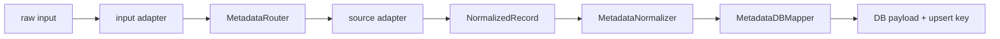

# Metadata 模块架构

`src/docset_hub/metadata` 是来源数据适配与统一契约层。它把不同来源、不同文件格式的论文记录转换为 MetadataDB 可以理解的标准写入 payload。

详细转换规则与示例见 [TRANSFORMER_README.md](TRANSFORMER_README.md)。

## 1. 核心职责

Metadata 模块负责：

- 解析 JSON、JSONL 等输入格式；
- 显式验证 `source_name`；
- 将来源字段映射到统一 `NormalizedRecord`；
- 归一化日期、语言、作者和其他字段值；
- 将统一记录映射为数据库写入 payload；
- 生成用于身份解析的 upsert key；
- 保留原始 payload 以支持追溯。

它不负责：

- 判断最终论文是否已存在；
- 分配 `paper_id` 或 `work_id`；
- 选择最终 canonical source；
- 写入 PostgreSQL；
- 构建 Dense、Sparse 或关键词索引。

## 2. 核心流水线



### 2.1 Input Adapter

负责文件格式解析，不负责来源字段语义。

当前主要实现：

- `JSONInputAdapter`
- `JSONLInputAdapter`

### 2.2 Metadata Router

验证调用方显式提供的 `source_name`，不再从 payload 自动猜测来源。

### 2.3 Source Adapter

理解来源字段并转换为统一结构。

当前正式映射：

| Source | Adapter |
| --- | --- |
| `langtaosha` | `LangtaoshaSourceAdapter` |
| `biorxiv_history` | `BiorxivSourceAdapter` |
| `biorxiv_daily` | `BiorxivSourceAdapter` |

### 2.4 NormalizedRecord

`NormalizedRecord` 是 metadata 内部最重要的领域契约，隔离来源差异与数据库结构。

它包含：

- 来源与原始数据；
- 核心论文元数据；
- 外部 identifiers；
- 作者与机构；
- 关键词；
- references。

### 2.5 Normalizer 与 DB Mapper

Normalizer 统一字段值语义；DB Mapper 将统一记录转换为面向数据库表的 payload，并生成 upsert key。

## 3. 输入与输出边界

输入：

```text
raw payload + explicit source_name
```

输出：

```text
TransformResult
  -> success
  -> source_name
  -> db_payload
  -> upsert_key
  -> error
```

转换阶段的 `work_id` 可能为空，因为最终身份由 MetadataDB 写入阶段决定。

## 4. Source 扩展方式

增加新来源时至少需要：

1. 明确新的稳定 `source_name`。
2. 实现 `BaseSourceAdapter`。
3. 将来源映射注册到 `MetadataTransformer.SOURCE_ADAPTERS`。
4. 确保 Router、配置和 storage 层允许该来源。
5. 为字段映射、必填字段、upsert key 和异常样本增加测试。

不能只在 Router 中加入来源名而不提供对应 Source Adapter。

## 5. Review 重点

1. `NormalizedRecord` 是否真正隔离来源差异。
2. Source Adapter 是否包含不属于转换层的业务决策。
3. Router 支持列表与 Transformer adapter 映射是否一致。
4. 原始数据是否可追溯，错误是否能定位到具体记录。
5. DB payload 是否泄漏了过多数据库实现细节到来源适配层。
6. 新来源接入是否有完整契约测试。

## 6. 相关文档

- [Docset Hub 总览](../README.md)
- [核心契约](../CORE_CONTRACTS.md)
- [数据写入与索引流](../flows/DATA_INGESTION_FLOW.md)
