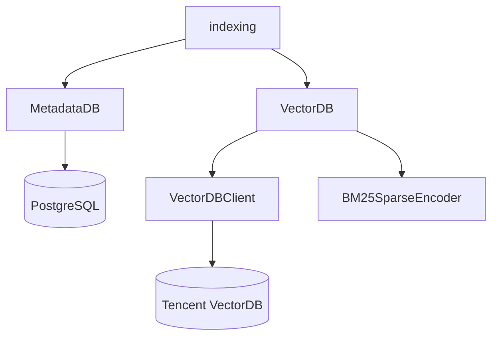

# Storage 模块架构

`src/docset_hub/storage` 封装 Docset Hub 的持久化与底层检索能力。当前主要后端为 PostgreSQL MetadataDB 和腾讯云 VectorDB。

详细手册：

- [METADATA_DB_README.md](METADATA_DB_README.md)
- [VECTOR_DB_README.md](VECTOR_DB_README.md)

## 1. 核心职责

Storage 模块负责：

- PostgreSQL 论文身份解析、写入、查询与删除；
- canonical source 选择；
- 作者、关键词、reference 和 enrichment 状态持久化；
- embedding 状态追踪；
- Dense 与 Sparse collection 管理；
- Dense、Sparse 与 storage 层 Hybrid 检索；
- 封装腾讯云 VectorDB HTTP API；
- BM25 sparse 编码。

它不负责：

- 来源 payload 适配；
- 跨存储写入和检索编排；
- query understanding；
- 每日任务调度；
- HTTP 产品 API。

## 2. 组件结构



| 组件 | 核心功能 |
| --- | --- |
| `MetadataDB` | PostgreSQL 领域存储、身份解析、canonical 与 metadata 查询 |
| `VectorDB` | source/collection 映射、文档写入和 Dense/Sparse 检索 |
| `VectorDBClient` | 腾讯云 VectorDB HTTP 适配器 |
| `BM25SparseEncoder` | 文档与 query 的 sparse vector 编码 |
| `json_storage` | JSON 存储辅助能力 |
| `version_utils` | 同来源版本更新判断 |

## 3. MetadataDB

### 3.1 写入职责

MetadataDB 将 Transformer 产生的 DB payload 应用到 PostgreSQL：

```text
validate source consistency
  -> resolve identity
  -> insert / update / append / skip
  -> apply canonical strategy
  -> return structured write result
```

身份解析结果：

```text
same_source | cross_source | no_match
```

### 3.2 查询职责

除论文详情读取外，MetadataDB 还提供：

- 作者搜索与候选建议；
- query term 建议；
- keyword lookup；
- generated keyword 写入与读取；
- embedding candidate 与状态管理；
- 按 `work_id` 批量 hydrate；
- 作者补全状态管理。

这意味着 MetadataDB 当前既是 metadata 持久化层，也承载部分检索辅助能力。

## 4. VectorDB

VectorDB 将 source 映射为独立 collection：

```text
Dense:  <collection_prefix><source_name>
Sparse: <sparse_collection_prefix><source_name>
```

主要能力：

- 创建和检查 database / collection；
- 写入与删除 Dense 文档；
- 写入与删除 Sparse 文档；
- Dense 搜索；
- Sparse/BM25 搜索；
- Dense + Sparse storage 层 RRF。

VectorDB 返回轻量 `SearchResult`，完整 metadata 由 indexing 层通过 MetadataDB hydrate。

## 5. 跨存储边界

PostgreSQL 是 metadata 与论文身份的事实来源。VectorDB 是可重建的检索资产。

关键连接键：

```text
work_id
```

约束：

- VectorDB 文档必须携带合法 `work_id`。
- VectorDB 不负责生成或决定论文身份。
- Dense 与 Sparse collection 中的 source 语义应与 MetadataDB 一致。
- VectorDB 结果无法 hydrate 时应被视为一致性异常。

## 6. 两种检索融合层级

Storage 层提供：

```text
VectorDB.hybrid_search()
  = Dense + Sparse RRF
```

Indexing 层提供：

```text
PaperIndexer.hybrid_retrieval_search()
  = Dense + Sparse + Keyword Lookup weighted RRF
```

正式 API 当前使用 indexing 层能力。Storage 层 hybrid 应被视为底层能力，不能默认代表产品检索策略。

## 7. Review 重点

1. MetadataDB 是否承担了过多检索策略职责。
2. PostgreSQL 是否明确作为身份与 metadata 事实来源。
3. Dense、Sparse 与 PostgreSQL 的一致性如何验证和修复。
4. collection 命名与 source 配置是否始终一致。
5. embedding 状态是否覆盖 Sparse 和其他检索资产。
6. VectorDBClient 的错误是否被上层正确分类。
7. 删除和 canonical 变化时是否清理旧检索资产。

## 8. 相关文档

- [Docset Hub 总览](../README.md)
- [核心契约](../CORE_CONTRACTS.md)
- [数据写入与索引流](../flows/DATA_INGESTION_FLOW.md)
- [查询与检索流](../flows/SEARCH_RETRIEVAL_FLOW.md)
